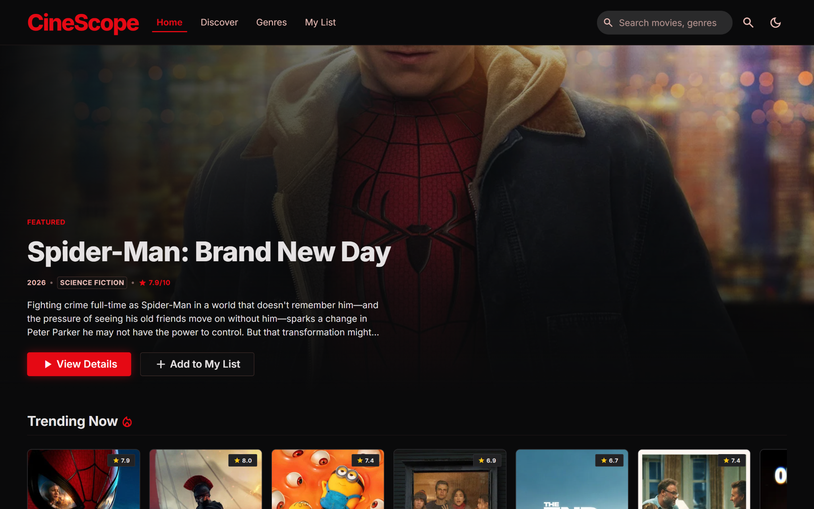
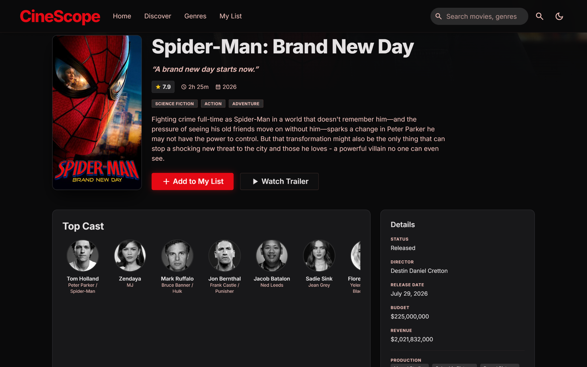
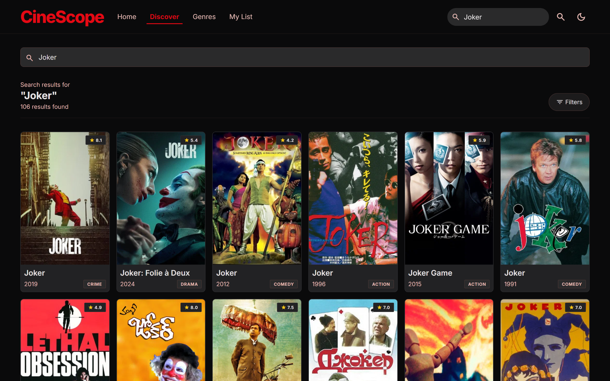
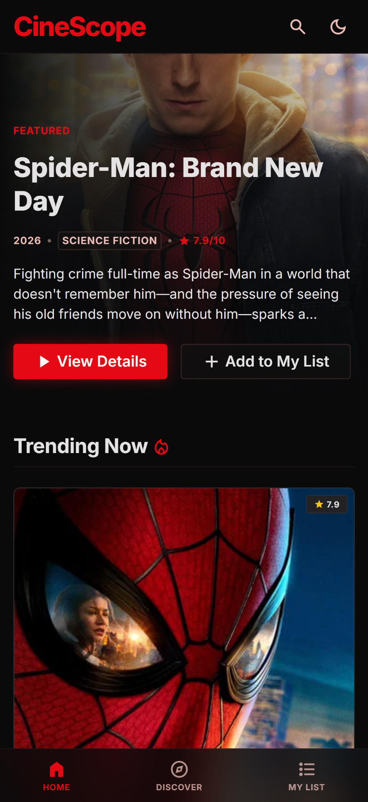

# 🎬 CineScope

A cinematic movie discovery web app for exploring trending, popular and upcoming movies, searching by title, filtering the catalogue, viewing movie details and saving titles to a personal watchlist.

Built with **HTML, CSS and Vanilla JavaScript**, powered by the **TMDB API**.

🌐 **[Live Demo](https://dev-allahverdi.github.io/cinescope/)**

> The app requires your own TMDB API key to load movie data. See [Run Locally](#-run-locally) for setup instructions.

---

## 🎥 Preview



---

## ✨ Features

- Browse trending, popular, top-rated and upcoming movies
- Search movies by title
- Filter movies by genre, year and rating
- Sort and paginate movie results
- View detailed movie information
- Explore cast, trailers and similar movies
- Save and remove movies from **My List**
- Persistent watchlist with `localStorage`
- Dark and light themes
- Responsive desktop and mobile layouts
- Loading skeletons and designed error states
- Mobile navigation and filter drawer
- Keyboard-friendly dialogs and accessible interface elements
- Hash-based client-side routing

---

## 🛠️ Tech Stack

| Technology   | Usage                                  |
| ------------ | -------------------------------------- |
| HTML5        | Semantic page structure                |
| CSS3         | Styling, responsive layouts and themes |
| JavaScript   | Application logic and interactivity    |
| TMDB API     | Movie data, cast, trailers and artwork |
| LocalStorage | Watchlist, theme and API key storage   |
| GitHub Pages | Static deployment                      |

CineScope uses **no frontend framework, bundler or backend**.

---

## 🤖 AI-Assisted Development

CineScope was created using an **AI-assisted development workflow**.

### Tools used

- **Google Stitch** — initial UI design and visual direction
- **ChatGPT** — planning, problem-solving and iteration
- **Claude Code** — implementation, debugging and code refinement

The project started from a Google Stitch design export and was developed into a working web application using plain HTML, CSS and JavaScript.

My role throughout the project included:

- Defining the product direction
- Deciding which features to include
- Reviewing and refining the interface
- Testing the application
- Identifying bugs and usability problems
- Guiding implementation changes and iterations
- Managing the overall project direction

At the same time, I'm studying **HTML, CSS and JavaScript from the fundamentals** so I can increasingly understand, review and build the code behind projects like CineScope independently.

---

## 🖼️ Screenshots

### Movie Details



### Search Results



### Mobile



---

## 📁 Project Structure

```text
cinescope/
├── css/
│   └── styles.css
│
├── design/
│   └── DESIGN.md
│
├── js/
│   ├── config.js
│   ├── api.js
│   ├── store.js
│   ├── ui.js
│   ├── views.js
│   ├── router.js
│   └── app.js
│
├── home-dark.png
├── movie-details.png
├── search-results.png
├── mobile-home.png
├── index.html
├── README.md
├── LICENSE
└── .gitignore
```

### JavaScript responsibilities

- `config.js` — application configuration
- `api.js` — TMDB requests, caching and data handling
- `store.js` — watchlist, theme and shared state
- `ui.js` — reusable UI elements and DOM helpers
- `views.js` — page rendering
- `router.js` — client-side navigation
- `app.js` — application startup and global wiring

The application keeps these responsibilities separated without introducing a framework.

---

## 🌐 TMDB API

Movie data comes from **The Movie Database (TMDB)**.

CineScope uses TMDB for:

- Trending movies
- Popular movies
- Top-rated movies
- Upcoming movies
- Movie search
- Genre browsing
- Filtered discovery
- Movie details
- Cast information
- Trailers
- Similar movies
- Posters and backdrops

> This product uses the TMDB API but is not endorsed or certified by TMDB.

---

## 🚀 Run Locally

### 1. Clone the repository

```bash
git clone https://github.com/dev-allahverdi/cinescope.git
```

Move into the project:

```bash
cd cinescope
```

---

### 2. Start a local server

CineScope does not require installation or a build step.

Using Python:

```bash
python3 -m http.server 5173
```

Or using Node.js:

```bash
npx serve -l 5173
```

Then open:

```text
http://localhost:5173
```

---

### 3. Add a TMDB API key

Create a TMDB account and obtain a v3 API key from your TMDB account settings.

#### Option 1 — Browser storage

Open the browser developer console and run:

```js
localStorage.setItem("cinescope:tmdb_key", "PASTE_YOUR_KEY_HERE");

location.reload();
```

The key will only be stored in that browser.

To remove it later:

```js
localStorage.removeItem("cinescope:tmdb_key");

location.reload();
```

---

#### Option 2 — Local config

Open:

```text
js/config.js
```

Find:

```js
var TMDB_API_KEY = "YOUR_TMDB_API_KEY";
```

Replace the placeholder with your own key for local development.

> Do not commit your personal API key to the repository.

---

## 💾 LocalStorage

CineScope uses browser storage for:

- Saved movies in **My List**
- Dark/light theme preference
- TMDB API key when browser-based configuration is used

No user account or backend database is required.

---

## ♿ Accessibility

CineScope includes several accessibility-focused improvements:

- Semantic HTML landmarks
- Accessible navigation labels
- Keyboard navigation
- Visible focus states
- Accessible modal dialogs
- Escape-to-close interactions
- Focus restoration
- ARIA states for interactive controls
- Reduced-motion support
- Alternative text for meaningful images

This represents a practical accessibility effort and does not claim formal WCAG certification.

---

## 📱 Responsive Design

The interface adapts across desktop and mobile layouts.

Responsive features include:

- Flexible movie grids
- Mobile navigation
- Mobile filter drawer
- Responsive hero sections
- Adaptive movie detail layouts
- Touch-friendly controls

---

## 🎨 Design

The original visual direction was created with **Google Stitch** and then adapted and expanded during development.

The final interface includes:

- Cinematic dark styling
- Light and dark themes
- Movie poster grids
- Featured hero content
- Loading states
- Empty states
- Error states
- Movie details
- Search and discovery interfaces
- Responsive mobile layouts

---

## 📄 License

This project is licensed under the **MIT License**.

See [LICENSE](LICENSE) for details.

Movie data and artwork are provided by **TMDB** and remain subject to TMDB's terms of use.
